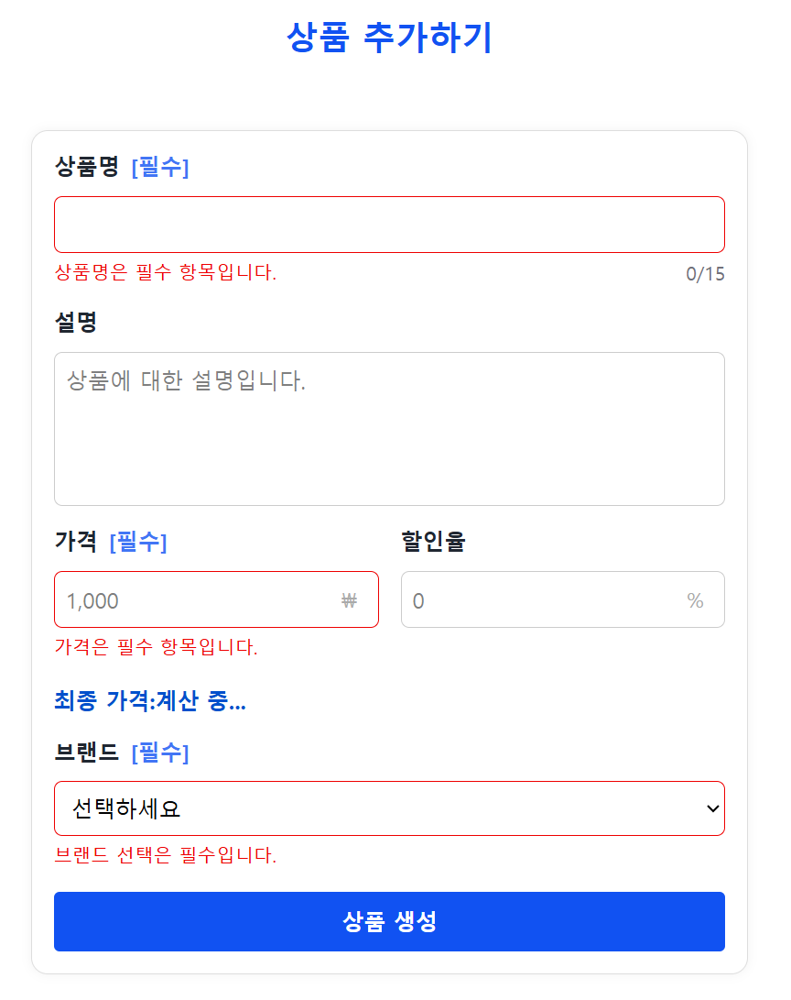
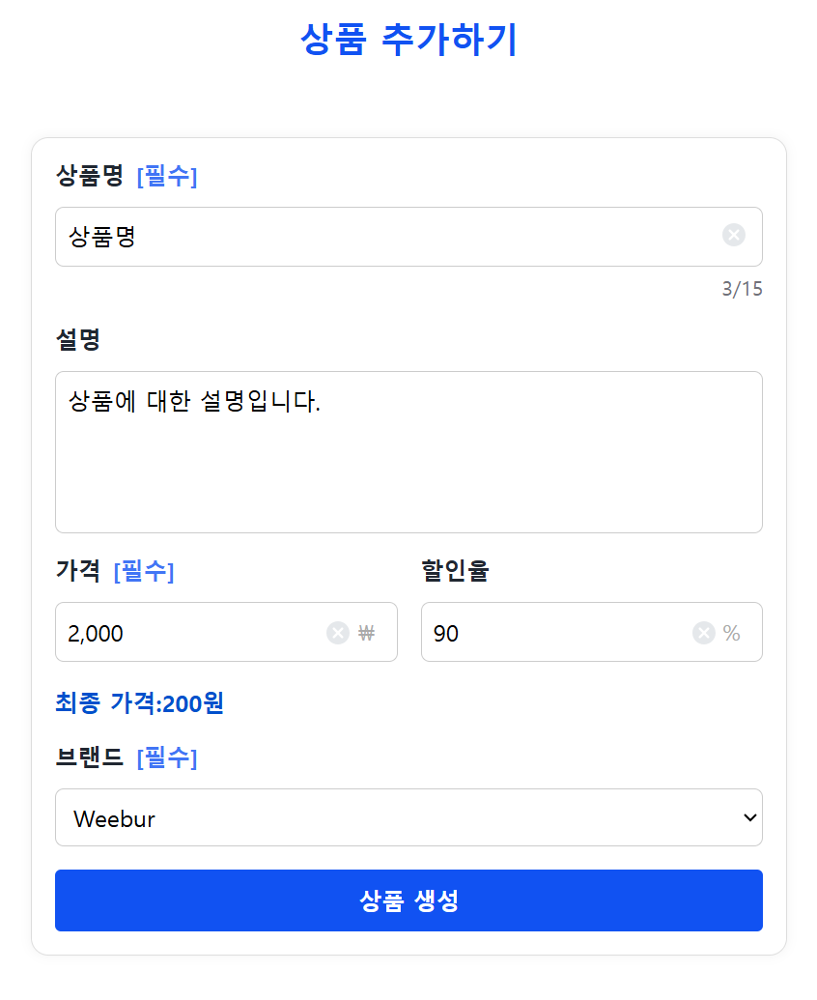
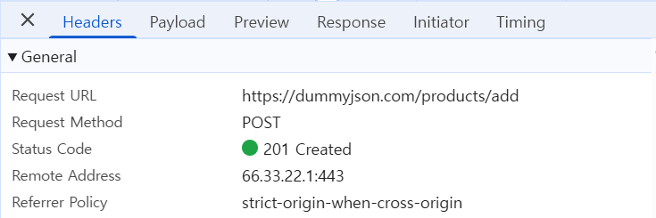
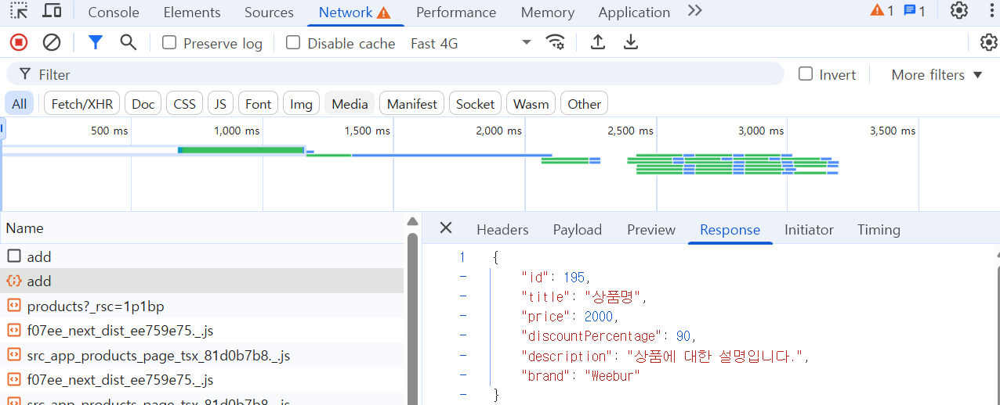
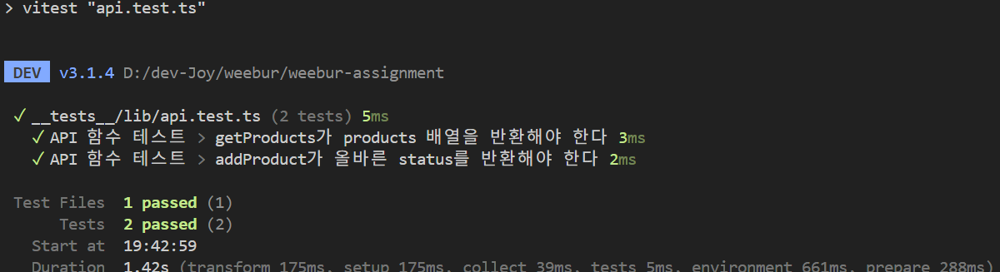
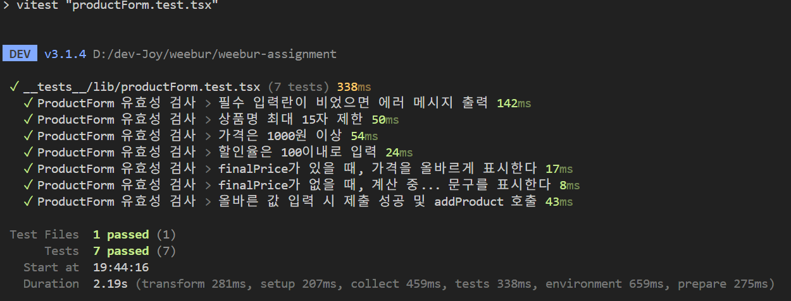

# WEEBUR 프론트엔드 코딩 과제

프론트엔드 개발자의 문제 해결 능력, 컴포넌트 설계 능력, 코드 품질, UI 구현, 사용자 경험 등의 역량을 종합적으로 확인하기 위한 과제입니다.

**구현기간**: 2025.05.28 ~ 2025.06.03

## 개발 계획 및 설계 과정

### 1. 프로젝트 구조 설계

- App Router 기반으로 페이지, 컴포넌트, 유틸을 명확히 분리하여 유지보수성과 확장성을 고려하였습니다.
- 기능별 디렉토리 구성 방식을 채택하여 `/products`, `/products/new` 각각 독립적으로 관리될 수 있도록 구성했습니다.
- `lib`, `types`, `schemas`, `ui` 등은 공통 모듈로 관리하여 코드 중복을 줄였습니다.

### 2. 뷰 랜덤 처리 및 상태 유지 설계

- 사용자 경험을 위해 **최초 접속 시 Middleware에서 쿠키 기반 뷰 타입 지정** 로직을 우선 구현하였습니다.
- 뷰 타입은 랜덤하게 정해지며, 쿠키의 만료 기간을 24시간으로 설정하여 조건 충족 시 변경 가능하도록 했습니다.

### 3. 상품 리스트 페이지 구현

- API 연동 → 데이터 파싱 → 카드/리스트 UI 분리 → 뷰 타입별 렌더링 로직 적용 순으로 구현했습니다.
- 리뷰 수 필드는 dummy API에서 reviews 배열의 length를 이용했습니다.

### 4. 상품 생성 페이지 구현

- Form 상태 관리를 위해 `React Hook Form + Zod` 조합을 먼저 구성하고, 재사용 가능한 `Input`, `Select`, `TextArea` 컴포넌트를 개발했습니다.
- 할인율이 입력되면 `useWatch` 을 사용하여 실시간으로 최종 가격을 계산해 표시했습니다.

### 5. 테스트 및 QA

- 주요 API와 Form 유효성 로직에 대해 Vitest + RTL을 활용한 단위 테스트를 작성하여 안정성을 확보했습니다.

### 개발 설계 방향

| 항목                                  | 선택 이유                                                   |
| ------------------------------------- | ----------------------------------------------------------- |
| **App Router 기반 폴더 구조**         | 기능별 분리와 명확한 라우팅 관리                            |
| **React Hook Form + Zod**             | 폼 검증과 UI 분리를 동시에 고려한 효율적인 선택             |
| **Tailwind + Styled Components 병행** | 유틸 기반의 빠른 스타일링과 컴포넌트 단위 커스터마이징 병행 |
| **Middleware에서 cookie 제어**        | View 모드 유지 문제 해결 및 사용자 경험 향상                |
| **Vitest + RTL**                      | QA 시간 단축 및 주요 로직 단위 테스트 가능                  |

### 기술 스택

- **Framework**: [Next.js 15 (App Router)](https://nextjs.org/docs/app)
- **Language**: [TypeScript](https://www.typescriptlang.org/)
- **패키지 매니저** : [pnpm](https://pnpm.io/ko/)
- **Form 관리**: [React Hook Form](https://react-hook-form.com/)
- **유효성 검사**: [zod](https://zod.dev/)
- **스타일링**: [Tailwind CSS](https://tailwindcss.com/), [Styled Components](https://styled-components.com/)

### 시스템 요구사항

- Node 20 LTS 이상
- pnpm 10 이상

## 실행 방법

```bash
# 1. 설치
pnpm install

# 2. local 실행
pnpm dev

# 3. 접속
https://localhost:3000/products
```

### 폴더 구조 (App Router)

```
   ├─ src
   │  ├─ app
   │  │  ├─ components
   │  │  │  ├─ Carousel.tsx
   │  │  │  └─ forms
   │  │  │     ├─ Input.tsx
   │  │  │     ├─ Select.tsx
   │  │  │     └─ TextArea.tsx
   │  │  ├─ favicon.ico
   │  │  ├─ globals.css
   │  │  ├─ icon
   │  │  │  ├─ clear.tsx
   │  │  │  └─ star.tsx
   │  │  ├─ layout.tsx
   │  │  ├─ lib
   │  │  │  ├─ api.ts
   │  │  │  └─ registry.tsx
   │  │  ├─ not-found.tsx
   │  │  ├─ page.tsx
   │  │  ├─ products
   │  │  │  ├─ components
   │  │  │  │  ├─ ProductCard.tsx
   │  │  │  │  ├─ ProductForm.tsx
   │  │  │  │  ├─ ProductGridView.tsx
   │  │  │  │  ├─ ProductListItem.tsx
   │  │  │  │  └─ ProductListView.tsx
   │  │  │  ├─ new
   │  │  │  │  └─ page.tsx
   │  │  │  └─ page.tsx
   │  │  ├─ schemas
   │  │  │  └─ productSchema.ts
   │  │  ├─ types
   │  │  │  └─ product.ts
   │  │  └─ ui
   │  │     ├─ button.tsx
   │  │     └─ form.tsx
   │  └─ middleware.ts
   ├─ tsconfig.json
   ├─ vitest.config.ts
   ├─ vitest.setup.ts
   └─ __tests__
      └─ lib
         ├─ api.test.ts
         └─ productForm.test.tsx
```

## 상품 리스트 페이지 (`/products`)

### 기능 설명

- `/products` 페이지에 최초 진입한 사용자에게 50% 확률로 'list' 또는 'grid' 뷰 방식을 랜덤 지정
- 사용자는 지정된 뷰 방식만을 볼 수 있으며, 이후 24시간 동안 동일한 방식이 유지
- 24시간이 지나면 쿠키가 만료되며, 다시 진입 시 새로운 뷰 방식이 랜덤으로 지정

### 해결 방안

- `Next.js Middleware` 기능을 활용하여 요청(Request) 시점에 뷰 방식을 결정
- 사용자의 브라우저 쿠키에 view_type 값을 저장하여, 이미 지정된 사용자는 랜덤 로직을 다시 타지 않도록 방지
- 쿠키의 유효기간을 24시간(maxAge: 60 x 60 x 24)으로 설정하여, 하루 동안 같은 UI가 유지되도록 보장
- 사용자가 쿠키를 지우거나, 24시간이 경과했을 경우 다시 랜덤 로직이 실행되어 새로운 UI가 지정

**참고문서**

- [A/B 테스트 with Next.js & Vercel](https://vercel.com/blog/ab-testing-with-nextjs-and-vercel)
- [NextJS Middleware using cookies](https://nextjs.org/docs/app/building-your-application/routing/middleware#using-cookies)
- [Next.js의 Middleware를 사용하여 A/B Testing하기 (with GA4)](https://seoplee.tistory.com/75)

## 상품 생성 페이지 (`/products/new`)

### 사용 기술

- `React Hook Form` + `Zod`
  - `zodResolver`를 통한 schema 기반 유효성 검사
  - `mode: 'onChange'`를 통해 즉각적 피드백 제공

필드별 유효성:

| 필드명               | 필수 여부 | 유효성 조건                         |
| -------------------- | --------- | ----------------------------------- |
| `title`              | ✅        | 15자 이내                           |
| `description`        | ❌        |                                     |
| `price`              | ✅        | 1,000 이상 입력                     |
| `discountPercentage` | ❌        | 100이내로 입력                      |
| `brand`              | ✅        | Apple, Samsung, Weebur 중 하나 선택 |

### 유효성 검사 Form 화면



### 실시간으로 최종가격(할인 적용가) 표시

- [useWatch](https://www.react-hook-form.com/api/usewatch/) 및 useMemo로 실시간 반영  
   **문제**: price와 discountPercentage 입력 시 동적으로 계산된 결과 표시  
   **해결**: useWatch를 사용해 input value를 변환



### 네트워크

`AddProductRequestBody`값이 잘 넘어가는지 확인

  


## 개발 중 고려 사항 및 이슈

### 1. `app/components/forms/Input.tsx`

**숫자 입력 UX 개선**

- 숫자 입력값은 쉼표 포맷(#,#00)으로 보여주되, 전송 시에는 숫자 변환 처리

- Reack Hook Form의 [Controller](https://www.react-hook-form.com/api/usecontroller/controller/), [setValue](https://www.react-hook-form.com/api/useform/setvalue/)를 활용한 제어 컴포넌트 구현
- 최대값 이상 입력 방지, 숫자 외 입력 차단 등 UX 고려

### 2. 컴포넌트 재사용성

- Input, TextArea, Select 등을 범용 컴포넌트로 분리하여 다른 곳에서 React Hook Form 재사용성 확보

### 3. Build시 Type Error

- [zod preprocess Type Error](https://github.com/colinhacks/zod/issues/3537#issuecomment-2829790481)

## 기타

- Form 디자인은 styled components를 사용하였습니다.
- zod v4 안정화되면 [zod/v4 Simplified error customization](https://zod.dev/v4#simplified-error-customization)

**참고문서**

- [How to NextJS Styled Components](https://nextjs.org/docs/app/guides/css-in-js#styled-components)

## 테스트 코드

- 테스트 도구: [Vitest](https://vitest.dev/) + [React Testing Library](https://testing-library.com/docs/react-testing-library/intro/)
- 테스트 목적: API 응답, Form 유효성 검증 등 주요 비즈니스 로직에 대한 단위 테스트
- 테스트 파일:
  - `api.test.ts` : API 레이어의 정상 동작 확인
  - `productForm.test.tsx` : 폼 필드 유효성 체크 테스트

```bash
# 전체 테스트
pnpm test

# API 테스트
pnpm test api.test.ts

# Form 유효성 테스트
pnpm test productForm.test.tsx
```

### API 테스트



### Form 유효성 테스트


